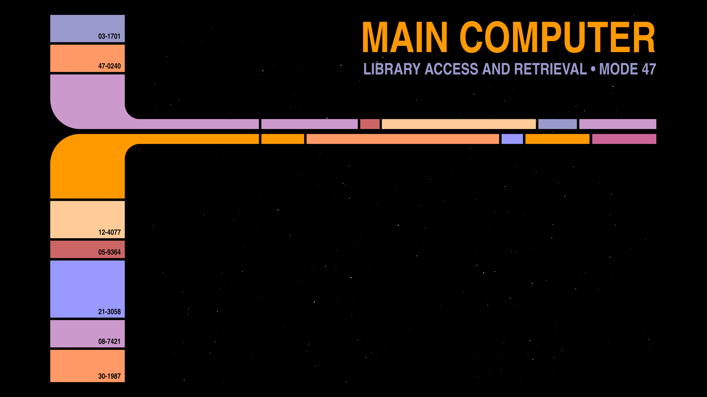

# LCARS — Omarchy theme

A dark [Omarchy](https://omarchy.org) theme inspired by the LCARS computer
interface from *Star Trek: The Next Generation*: pure black panels with
orange, peach, lilac and violet accents.



## Install

```bash
omarchy theme install https://github.com/Blackhydra78/omarchy-lcars-theme
```

Or pick it later with `omarchy theme set lcars`.

## What's inside

| File | Purpose |
|------|---------|
| `colors.toml` | Palette; Omarchy generates terminal, bar, Hyprland, btop, Neovim and editor colors from it |
| `backgrounds/` | Two 2560x1600 wallpapers: an LCARS frame and a starfield |
| `icons.theme`, `keyboard.rgb`, `chromium.theme` | Icon set, keyboard backlight and browser color |
| `scripts/gen-backgrounds.py` | Regenerates the wallpapers (needs `rsvg-convert`) |

## Palette

| Role | Color |
|------|-------|
| Accent / orange | `#ff9900` |
| Foreground / peach | `#ffcc99` |
| Tan | `#ff9966` |
| Lilac | `#cc99cc` |
| Violet | `#9999cc` |
| Blue | `#9999ff` |
| Red | `#cc6666` |
| Background | `#000000` |

## Disclaimer

Unofficial fan work. Star Trek and LCARS are trademarks of CBS Studios Inc.;
this project is not affiliated with or endorsed by them. The wallpapers are
original artwork generated by the included script. Code and artwork are MIT
licensed.
